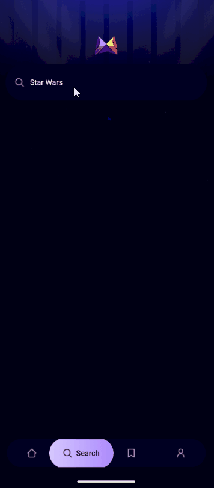

<p align="center">
  
</p>

<h1 align="center">🎬 MovieFlix</h1>

<p align="center">
  Мобильное приложение для поиска фильмов и просмотра подробной информации о них.<br />
  Постеры, рейтинги, описания, жанры.
</p>

---

## 📱 Превью 

Приложение в действии: плавный интерфейс, быстрый поиск и подробные карточки фильмов.  
Ниже — два ключевых сценария использования.

<p align="center">
  
  &nbsp;
  
</p>

<p align="center">
  <em>Слева: главный экран | Справа: поиск и просмотр деталей фильма</em>
</p>

---

## ⚠️ Доступ из России

📍 Важно для пользователей из РФ:

- API-источник заблокирован на территории России
- Без VPN приложение не сможет загружать фильмы
- ✅ Можно использовать **любой VPN**, даже встроенный (например, Opera)

---

## ⚙️ Стек технологий

- ⚛ **React Native** — кроссплатформенная разработка
- 🚀 **Expo** — мгновенная сборка и публикация
- 🎨 **NativeWind** — Tailwind CSS для мобильных интерфейсов
- 🔡 **TypeScript** — строгая типизация
- 🌐 **API для фильмов** — используется общедоступная кино-база

---
## 🔗 Как открыть приложение по ссылке в Expo Go

### 🔷 Шаги:

1. 📲 Установи **Expo Go** из App Store / Google Play  
2. 🔐 Запусти приложение и войди в свою учётную запись *(если нужно)*  
3. 🌐 Вставь ссылку [`https://expo.dev/@pvntheraxxx/movieflix`](https://expo.dev/@pvntheraxxx/movieflix) в браузер или просканируй QR-код  
4. 🚀 **Expo Go** откроет приложение автоматически

---

## 🛠 Установка и запуск

Следуй этим шагам, чтобы развернуть приложение у себя локально:

---

### 1. 📥 Склонируй репозиторий

```bash
git clone https://github.com/pvntheraxxx/movieflix.git
cd movieflix
```

### 2. 📥 Установи зависимости

```
npm install
```

### 3. 🧪 Добавь файл .env
Создай файл .env в корне проекта и добавь в него:

```
EXPO_PUBLIC_MOVIE_API_KEY = your_tmdb_token
EXPO_PUBLIC_APPWRITE_PROJECT_ID = your_appwrite_project_id_token
EXPO_PUBLIC_APPWRITE_DATABASE_ID = your_appwrite_database_id_token
EXPO_PUBLIC_APPWRITE_COLLECTION_ID = your_appwrite_collection_id_token
```
  🔐 API-ключ можно получить на themoviedb.org

### 4. 🚀 Запусти проект

```
npx expo start
```
📱 Отсканируй QR-код через Expo Go
или открой эмулятор Android через Android Studio

✅ Готово! Приложение работает локально и готово к разработке.
